# 📚 ReRead — เว็บไซต์แลกเปลี่ยนหนังสือมือสอง

> แพลตฟอร์มแลกเปลี่ยนหนังสือมือสอง พัฒนาด้วย React (Frontend) และ FastAPI (Backend) พร้อมฐานข้อมูล PostgreSQL
> ออกแบบในธีม "ร้านหนังสืออิสระยุคใหม่"

**Git Repo:** https://github.com/aphi0405/ReRead
**รายวิชา:** 89033167 Web Application Development · มหาวิทยาลัยบูรพา สาขาวิทยาการสารสนเทศ (sec 1)
**ผู้พัฒนา:** 67160383 นางสาวอภิสรา คล้ายบุรี · 67160244 นางสาวเอมิกา อยู่พันธ์
**อัปเดตล่าสุด:** 19 กันยายน 2569 (ตรวจสอบกับ commit `ad99356`)

---

## 📋 รายงานความคืบหน้าโครงการ

## 🎯 ประเมินผลงานตัวเอง: เสร็จประมาณ 40% จาก 100%

คิดตามเกณฑ์ประเมินรายวิชา (Web-Dev-Roadmap Week 3-12) โดยให้คะแนนความสำเร็จของแต่ละหัวข้อ แล้วถ่วงน้ำหนัก

| ช่วง / หัวข้อ | น้ำหนัก | ทำได้ | คะแนน | สิ่งที่ทำแล้ว → สิ่งที่ยังขาด |
|---|---:|---:|---:|---|
| Week 3-4 API Validation & Error Handling | 15% | 60% | 9.00 | Pydantic schema, รูปแบบ response เดียวกันทั้งระบบ, HTTP 401/403/404/422, global error handler → ยังไม่มี validator ของหนังสือ/คำขอ (เช่น `condition` รับค่าอะไรก็ได้), ไม่มี logging, ไม่มี custom exception |
| Week 5-6 Database Relations & Query | 15% | 55% | 8.25 | 3 ตาราง (`users`, `books`, `book_requests`) มี Foreign Key แบบ One-to-Many, index, Alembic migration 4 ไฟล์ → ไม่มี Many-to-Many, ยังไม่มีตาราง `swaps`/`messages`/`reviews`/`wishlists`, ยังไม่ได้วิเคราะห์ N+1 |
| Week 7-8 Frontend Integration | 20% | 45% | 9.00 | `services/api.ts` + `AuthContext`, หน้า Login/Signup/Browse/รายละเอียดหนังสือ/ลงหนังสือ/หนังสือของฉัน/Settings ต่อ API จริง → Dashboard/Chat/Wishlist/Profile ยังเป็น Mock, ปุ่มแก้ไขหนังสือไม่ทำงาน, บอร์ดตามหายังใช้งานไม่ได้ (ดูข้อบกพร่องด้านล่าง) |
| Week 9-10 Testing & Debugging | 20% | 10% | 2.00 | เขียนเทสต์ไว้ 25 ข้อ (auth 13, users 12) → **รันไม่ผ่านสักข้อ** (พังตอน setup), ไม่มีเทสต์ของ books/requests, ไม่มีเทสต์ฝั่ง frontend, วัด coverage จริงไม่ได้ (เป้า ≥ 70%) |
| Week 11-12 Security & Deployment | 30% | 40% | 12.00 | JWT + bcrypt, CORS whitelist, `.env` ไม่เข้า git, Docker Compose (db + api) → ไม่มี rate limit, `JWT_SECRET` ค่าเริ่มต้นไม่ปลอดภัย, ไม่มี Docker สำหรับ production, ยังไม่มีเอกสาร deploy ที่ยืนยันแล้ว |
| **รวม** | **100%** | | **≈ 40.25** | |

หมายเหตุการให้คะแนน: น้ำหนักรวมของ Week 3-6 (30%), Week 7-10 (40%), Week 11-12 (30%) มาจากเกณฑ์ของอาจารย์ ส่วนการแบ่งน้ำหนักภายในแต่ละกลุ่มเป็นการประเมินของทีมเอง (แบ่งเท่า ๆ กัน) มินิเกม ระบบขาย และไดอะแกรมสถาปัตยกรรม ไม่อยู่ในเกณฑ์นี้จึงไม่นับเป็น %

## ✅ ส่วนที่เสร็จแล้ว (ทดสอบแล้ว)

ทดสอบด้วยการรันจริงบน PostgreSQL 16 (ดูวิธีทดสอบด้านล่าง)

- **ระบบสมาชิก:** สมัคร (รหัสผ่านอ่อนถูกปฏิเสธ 422), ล็อกอินรับ JWT, ดูโปรไฟล์ตัวเอง (`/me`), ออกจากระบบ, เปลี่ยนรหัสผ่าน, เช็คชื่อผู้ใช้ซ้ำ, แก้ไข/ลบบัญชี (ทำได้เฉพาะเจ้าของ คนอื่นได้ 403)
- **ระบบหนังสือ (API):** เพิ่ม, แสดงรายการ + ค้นหา + แบ่งหน้า, ดูรายละเอียด, หนังสือของฉัน, แก้ไข, ลบ (เฉพาะเจ้าของ คนอื่นได้ 403 และต้องล็อกอินก่อนเพิ่ม)
- **ฐานข้อมูล:** Alembic migration ทั้ง 4 ไฟล์รันผ่านบนฐานข้อมูลเปล่า ได้ 3 ตารางตามที่ออกแบบ
- **CORS:** อนุญาตเฉพาะ localhost และโดเมน Vercel ของโปรเจกต์ ปฏิเสธโดเมนอื่น
- **Frontend:** `npm run build` (tsc + vite) ผ่าน และ `npm run lint` ไม่มี error (มีคำเตือน 3 รายการ)
- **หน้าเว็บ 14 หน้า** ตามดีไซน์ "ร้านหนังสืออิสระยุคใหม่" (ส่วนที่ต่อ API จริงคือหน้าที่ระบุไว้ในตาราง Week 7-8 ด้านบน)

## ⚠️ ส่วนที่เสร็จบางส่วน / มีข้อบกพร่อง

| ส่วน | ปัญหาที่พบ |
|---|---|
| **บอร์ดตามหาหนังสือ** | ❌ **ใช้งานจริงไม่ได้:** `GET /api/requests` และ `POST /api/requests` ตอบ HTTP 500 เพราะ `BookRequestOwner` ใน `backend/app/schemas/book_request.py` ไม่ได้ตั้ง `from_attributes=True` หน้า UI และ API ถูกเขียนไว้ครบ แต่ยังใช้งานไม่ได้จนกว่าจะแก้ |
| **เทสต์ฝั่ง backend** | ทั้ง 25 ข้อ error ตอน setup: `Book.tags` ใช้ชนิด `ARRAY` ของ PostgreSQL แต่ `tests/conftest.py` ใช้ SQLite ซึ่งไม่รองรับ จึงสร้างตารางไม่ได้ |
| **ปุ่ม "แก้ไข" หนังสือ** | หน้า "หนังสือของฉัน" มีปุ่มแต่ยังไม่มีหน้าแก้ไขหรือ handler (API `PUT /api/books/{id}` ใช้งานได้แล้ว) |
| **อัปโหลดรูปปกหนังสือ** | เก็บ `blob:` URL ของเบราว์เซอร์ลงฐานข้อมูล คนอื่นจะมองไม่เห็นรูป และรูปหายเมื่อรีเฟรช ยังไม่มีระบบอัปโหลดไฟล์จริง |
| **หน้าค้นหา (Browse)** | ดึงหนังสือ 100 เล่มแรกมากรองที่ฝั่ง client (หมวดหมู่/สภาพ/สถานะ) ยังไม่ได้กรองที่ server เมื่อมีหนังสือเกิน 100 เล่มจะค้นไม่ครบ (ช่องค้นหา API `?search=` ใช้ได้ แต่หน้า Browse ยังไม่ได้เรียกใช้) |
| **Validation ของหนังสือ** | `condition` รับค่าอะไรก็ได้ (ทดสอบส่ง "Banana" ผ่าน) |
| **Protected Routes** | จากการตรวจโค้ด มีเฉพาะหน้า Settings ที่ redirect ไปหน้า Login เมื่อยังไม่ล็อกอิน หน้าสมาชิกอื่นยังไม่ป้องกันที่ฝั่ง frontend (ฝั่ง API ป้องกันแล้ว) |
| **หน้า Landing** | หนังสือแนะนำมาจาก `mockBooks.ts` และตัวเลข "12,000 คน / 45,000 เล่ม" เป็นค่าคงที่ |
| **Social Login (Google/GitHub)** | มีเฉพาะปุ่มใน UI ยังไม่ทำงาน |
| **Docker / Deploy** | มี `docker-compose.yml` สำหรับ dev (db + api) แต่ยังไม่ได้ทดสอบ และไม่มีการตั้งค่า production หน้าเว็บน่าจะ deploy บน Vercel (ดูจากรายการ CORS) แต่ยังไม่ได้ยืนยัน |
| **ไฟล์ขยะใน repo** | ไฟล์ว่างชื่อ `JSONResponse` และ `dict[str` ที่ root รอลบ |

## ❌ ส่วนที่ยังไม่เสร็จ

- **ระบบแลกเปลี่ยน (Swap):** ตาราง + API สำหรับ "เสนอแลก → ตอบรับ → จัดส่ง → ได้รับหนังสือ" หน้า Dashboard และปุ่ม "เสนอแลกเปลี่ยน" ยังเป็น UI เท่านั้น
- **แชท:** ยังไม่มีตารางข้อความและ API หน้า Chat เป็น Mock
- **Wishlist:** ยังเป็นข้อมูลตายตัว
- **Profile:** ประวัติการแลก คะแนนรีวิว และแต้มสะสมยังเป็น Mock
- **ระบบรีวิว/ให้คะแนน, แจ้งเตือน, Report Issue**, การยืนยันตัวตน
- **เทสต์ที่รันผ่านและ coverage ≥ 70%**, CI
- **Docker สำหรับ production และการ deploy พร้อมเอกสาร**
- **มินิเกมงูกินผลไม้สะสม coins** และ **ระบบขายหนังสือมือสองพร้อมค่าธรรมเนียม** (ข้อเสนอแนะจากผู้ฟัง ยังไม่เริ่ม)

## 🗺️ เทียบกับ User Journey Map

| ขั้นตอน | สถานะ |
|---|---|
| **Discover** | มีหน้า Landing แล้ว ยังไม่มี SEO/meta tags |
| **Sign Up / Login** | สมัครและล็อกอินได้จริง · ยังไม่มี Social Login และการยืนยันตัวตน |
| **Browse & Select** | ค้นหา/กรอง/ดูรายละเอียดได้จริง · ยังไม่มีการเสนอแลก ระบบรีวิวความน่าเชื่อถือ และรูปหลายมุม |
| **Purchase (แลกเปลี่ยน)** | มีเฉพาะ UI (Dashboard, Stepper, ลิงก์ติดตามพัสดุ) เป็น Mock ทั้งหมด |
| **Post-Purchase / Retain** | ยังไม่มีระบบให้คะแนน/รีวิว แจ้งเตือน และ Report Issue |

Pain Point หลักตาม Journey คือ **ความเชื่อมั่น (Trust)** ซึ่งเป็นส่วนที่ยังขาดมากที่สุด

สถาปัตยกรรมปัจจุบันของระบบเป็น **monolith** (FastAPI ตัวเดียว + PostgreSQL หนึ่งฐาน) ไดอะแกรม Microservices ที่จะเพิ่มคือ "สถาปัตยกรรมเป้าหมาย" ยังไม่ได้แยกโค้ดเป็นหลาย service จริง

## 🔬 วิธีตรวจสอบ และสิ่งที่ยังไม่ได้ทดสอบ

- **ทดสอบแล้ว:** รัน `alembic upgrade head` และ `uvicorn` บน PostgreSQL 16 (Python 3.12) แล้วยิง API ด้วย `curl` ครอบคลุม auth, users, books, requests และการตรวจสิทธิ์; รัน `npm run build` และ `npm run lint`; รัน `pytest` (ผลตามหัวข้อข้อบกพร่อง)
- **ยังไม่ได้ทดสอบ:** การรันผ่าน Docker Compose, การใช้งาน UI ในเบราว์เซอร์, การ deploy จริงบนออนไลน์

## 🚀 แผนงานถัดไป

ส่วนนี้เป็นแผน ไม่นับเป็นความคืบหน้าข้างต้น

1. แก้ข้อบกพร่องที่พบ (บอร์ดตามหา, เทสต์, ปุ่มแก้ไข, อัปโหลดรูปปก, กรองที่ server)
2. สร้างระบบ Swap, แชท, Wishlist, รีวิว และต่อเข้ากับหน้า Dashboard/Chat/Wishlist/Profile
3. เขียนเทสต์ให้ครบและวัด coverage ให้ถึง 70% พร้อม CI
4. Docker production และ deploy พร้อมเอกสาร
5. **มินิเกมงูกินผลไม้** เก็บ coins สะสม (ตรวจคะแนนที่ server และจำกัด coins ต่อวันเพื่อกันการโกง)
6. **ระบบขายหนังสือมือสอง** พร้อมค่าธรรมเนียมแพลตฟอร์ม (เริ่มต้นประมาณ 5-10%) และนำ coins มาใช้ลดค่าธรรมเนียมหรือดันประกาศ เพื่อให้เงินหมุนเวียนในระบบ

## 🏗️ Microservices Architecture

สีเขียว = มีแล้วในระบบปัจจุบัน (ยังอยู่ใน monolith เดียว) · เส้นประสีเทา = แผนในอนาคต
คลิกที่ภาพเพื่อดูขนาดเต็ม

[](docs/microservices-architecture.svg)

## 🧱 Technology Stack Diagram

[](docs/tech-stack-diagram.svg)

---

## 📖 รายละเอียดโปรเจกต์

### 🖼️ ภาพรวม

ReRead เป็นแพลตฟอร์มสำหรับนักอ่านที่ต้องการส่งต่อหนังสือที่อ่านจบแล้ว และค้นหาหนังสือใหม่จากชุมชนนักอ่านด้วยกัน

### ✨ ฟีเจอร์ที่ใช้งานได้จริง (Full-stack)

- 🔐 ระบบสมาชิก JWT (สมัคร, ล็อกอิน, โปรไฟล์, เปลี่ยนรหัสผ่าน)
- 🔍 ค้นหาและดูรายละเอียดหนังสือจากฐานข้อมูลจริง
- 🏷️ ลงรายการ / ลบหนังสือของตัวเอง (เฉพาะสมาชิกที่ล็อกอิน)
- ℹ️ หน้า About Us และ Settings

### 🧪 ฟีเจอร์ที่เป็น Mock หรือยังไม่สมบูรณ์

- 💬 ระบบแชท (Mock)
- 📦 Dashboard ติดตามสถานะการแลกเปลี่ยน (Mock)
- 🔖 Wishlist และสถิติในหน้า Profile (Mock)
- 📋 บอร์ดตามหาหนังสือ (เขียนครบ แต่ API ยังตอบ 500 ดูหัวข้อข้อบกพร่อง)

### 🛠️ Tech Stack

#### Frontend
| เทคโนโลยี | เวอร์ชัน | วัตถุประสงค์ |
|---|---|---|
| [React](https://react.dev/) | 19 | UI Framework |
| [TypeScript](https://www.typescriptlang.org/) | 6 | Type Safety |
| [Vite](https://vitejs.dev/) | 8 | Build Tool & Dev Server |
| [Tailwind CSS](https://tailwindcss.com/) | 3 | Styling (Custom Theme) |
| [React Router](https://reactrouter.com/) | 7 | Client-side Routing |
| [Lucide React](https://lucide.dev/) | Latest | Icon Library |
| oxlint | 1.x | Linting |

#### Backend & Database
| เทคโนโลยี | เวอร์ชัน | วัตถุประสงค์ |
|---|---|---|
| [FastAPI](https://fastapi.tiangolo.com/) | 0.115 | REST API Framework |
| [PostgreSQL](https://www.postgresql.org/) | 16 | Relational Database |
| [SQLAlchemy](https://www.sqlalchemy.org/) | 2.0 (async, asyncpg) | ORM |
| [Alembic](https://alembic.sqlalchemy.org/) | 1.15 | Database Migrations |
| Pydantic | v2 | Validation & Schemas |
| python-jose / bcrypt | — | JWT / Password hashing |
| pytest | 8 | Testing (ปัจจุบันยังรันไม่ผ่าน) |
| [Docker](https://www.docker.com/) | — | Containerization (Python 3.11 image) |

### ✅ สิ่งที่ต้องติดตั้งก่อน (Prerequisites)

1. **Node.js** เวอร์ชัน 18 ขึ้นไป (สำหรับ Frontend)
2. **Docker Desktop** (สำหรับ Backend และ Database)

### 🚀 วิธีติดตั้งและรันโปรเจกต์

#### ขั้นตอนที่ 1: เตรียมความพร้อม
```bash
git clone https://github.com/aphi0405/ReRead.git
cd ReRead
```

#### ขั้นตอนที่ 2: ตั้งค่า Environment Variables
```bash
cp .env.example .env
```
*(Windows PowerShell: `Copy-Item .env.example .env`)*
ก่อนใช้งานจริงให้เปลี่ยนค่า `JWT_SECRET` เป็นค่าสุ่มที่คาดเดาไม่ได้

#### ขั้นตอนที่ 3: รัน Backend & Database (ผ่าน Docker)
```bash
docker compose up --build -d
docker compose exec api alembic upgrade head
```
> API: **http://localhost:8000** (เอกสาร API: http://localhost:8000/docs)

(ทางเลือก) ใส่ข้อมูลตัวอย่างหนังสือ 48 เล่ม:
```bash
docker compose exec api python -m app.seed_books
```

#### ขั้นตอนที่ 4: รัน Frontend
```bash
npm install
npm run dev
```
> เว็บไซต์: **http://localhost:5173**
> ถ้า API ไม่ได้อยู่ที่ `http://localhost:8000` ให้ตั้งค่า `VITE_API_URL`

#### คำสั่งอื่นที่ใช้บ่อย
```bash
npm run build     # build frontend
npm run lint      # ตรวจโค้ด frontend
docker compose exec api pytest tests/ -v   # เทสต์ backend (ปัจจุบันยังรันไม่ผ่าน ดูหัวข้อข้อบกพร่อง)
```

### 🌐 หน้าเว็บทั้งหมด (14 หน้า)

| URL | หน้า | ข้อมูล |
|---|---|---|
| `/` | หน้าแรก | หนังสือแนะนำเป็น Mock |
| `/browse` | ค้นหาหนังสือ | API จริง |
| `/book/:id` | รายละเอียดหนังสือ | API จริง |
| `/login`, `/signup` | เข้าสู่ระบบ / สมัครสมาชิก | API จริง |
| `/add-book` | ลงรายการหนังสือ | API จริง (รูปปกยังมีปัญหา) |
| `/my-books` | หนังสือของฉัน | API จริง (ปุ่มแก้ไขยังไม่ทำงาน) |
| `/requests` | บอร์ดตามหาหนังสือ | ต่อ API แล้ว แต่ติดข้อบกพร่อง (HTTP 500) |
| `/settings` | ตั้งค่าบัญชี | API จริง |
| `/about` | เกี่ยวกับเรา | เนื้อหาคงที่ |
| `/dashboard` | แผงควบคุมการแลกเปลี่ยน | Mock |
| `/chat` | แชท | Mock |
| `/wishlist` | รายการที่บันทึกไว้ | Mock |
| `/profile` | โปรไฟล์ | ข้อมูลผู้ใช้จริง สถิติ/ประวัติเป็น Mock |

รายละเอียดดีไซน์และ component ดูเพิ่มที่ [`project_summary.md`](project_summary.md) และรายละเอียด API ดูที่ [`backend/README.md`](backend/README.md)

### 📂 โครงสร้างโปรเจกต์

```
ReRead/
├── backend/            # FastAPI (routers, schemas, crud, models, alembic, tests)
├── src/                # React (pages, components, contexts, services, data)
├── public/             # รูป avatar และไอคอน
├── docker-compose.yml  # db (PostgreSQL 16) + api (FastAPI)
├── .env.example
├── project_summary.md  # สรุปดีไซน์และหน้าเว็บ
└── README.md
```

### 👩‍💻 ผู้พัฒนา
ชื่อ: 67160383 อภิสรา คล้ายบุรี, 67160244 นางสาวเอมิกา อยู่พันธ์
รายวิชา: 89033167 Web Application Development